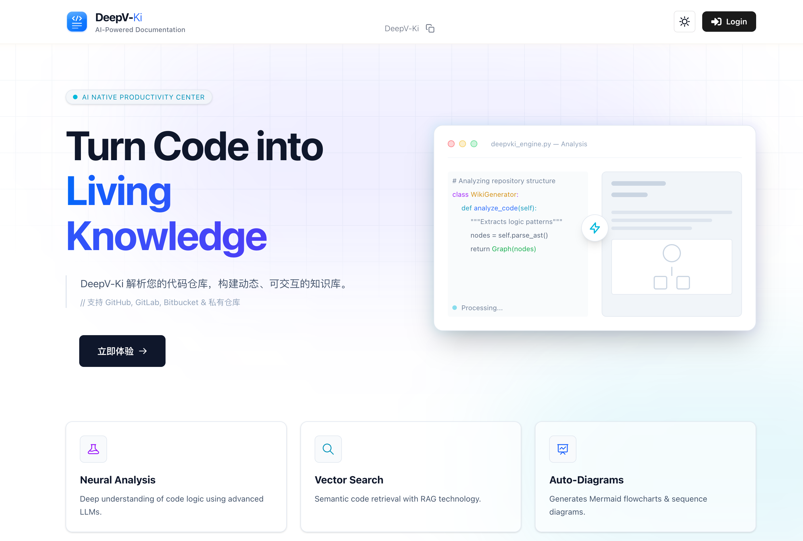
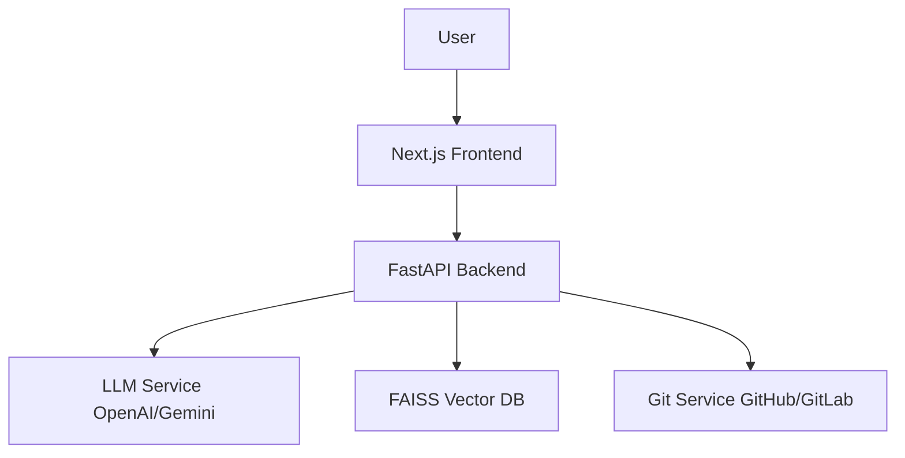

<div align="center">
  <a href="https://github.com/OrionStarAI/DeepV-Ki">
    
  </a>

  <h1 align="center">DeepV-Ki</h1>

  <p align="center">
    <strong>AI-Powered Wiki Generator for Code Repositories</strong>
  </p>
  <p align="center">
    Turn any Git repository into a beautiful, interactive Wiki in minutes | Intelligent Architecture Analysis | RAG Code Q&A
  </p>

  <p align="center">
    <a href="https://github.com/OrionStarAI/DeepV-Ki/blob/main/LICENSE">
      
    </a>
    <a href="https://www.python.org/">
      
    </a>
    <a href="https://nextjs.org/">
      
    </a>
    <a href="https://github.com/OrionStarAI/DeepV-Ki/stargazers">
      
    </a>
    <a href="https://github.com/OrionStarAI/DeepV-Ki/issues">
      
    </a>
  </p>

  <p align="center">
    <a href="README.md">中文</a> | <strong>English</strong>
  </p>
</div>

<br/>

## 📖 Introduction

**DeepV-Ki** is an open-source, AI-powered Wiki generator designed to solve the challenges of maintaining and reading code documentation. Simply enter a repository URL, and DeepV-Ki will automatically analyze the code structure, generate detailed documentation, draw architecture diagrams (Mermaid), and build an interactive knowledge base supporting RAG (Retrieval-Augmented Generation) Q&A.

Whether it's GitHub, GitLab, or Bitbucket, DeepV-Ki helps developers quickly understand complex codebases.

<div align="center">
  
</div>

## 🌟 Features

| Feature | Description |
| :--- | :--- |
| 📚 **One-Click Wiki Generation** | Turn any code repository into a professional interactive Wiki, supporting 10+ languages (English, Chinese, Japanese, etc.). |
| 🧠 **Intelligent Code Analysis** | Uses AI to deeply understand code structure, design patterns, and core logic, automatically generating table of contents and navigation. |
| 📊 **Automatic Architecture Diagrams** | Automatically generates Mermaid flowcharts, sequence diagrams, and class diagrams, with support for interactive zooming and panning. |
| 💬 **RAG Code Q&A** | Built-in **Ask** feature for accurate Q&A based on actual code, supporting multi-turn conversations and streaming responses. |
| 🕵️ **DeepResearch** | Deep research mode that automatically generates research plans and conducts multi-round iterative investigations to output comprehensive conclusions. |
| 🔌 **Multi-Model Support** | Supports OpenAI, Google Gemini, Azure, AWS Bedrock, Ollama (Local), and other LLMs. |
| 🛡️ **Broad Repository Support** | Supports GitHub, GitLab (SaaS/Self-hosted), Bitbucket, Gerrit, and private repositories. |

## 🚀 Quick Start

### Prerequisites

*   **Python 3.12+** (Backend)
*   **Node.js 18+** (Frontend)
*   **pnpm** (Frontend Package Manager)
*   **uv** (Python Package Manager, Recommended)

### 1. Clone Repository

```bash
git clone https://github.com/OrionStarAI/DeepV-Ki.git
cd DeepV-Ki
```

### 2. Configure Environment

Copy the example configuration file and fill in the necessary API Keys (e.g., OpenAI or GitLab configuration):

```bash
cp .env.example .env
# Edit .env file
# Required: OPENAI_API_KEY (or other LLM Key)
# Optional: GITLAB_CLIENT_ID (if OAuth is needed)
```

### 3. One-Click Start

We provide a unified development environment startup script:

```bash
./start_dev.sh
```

After successful startup, visit:
*   **Frontend**: [http://localhost:3000](http://localhost:3000)
*   **Backend API**: [http://localhost:8001/docs](http://localhost:8001/docs)

## 🛠️ Configuration

DeepV-Ki supports flexible environment variable configuration. Main configuration items include:

| Variable Name | Description | Example |
| :--- | :--- | :--- |
| `OPENAI_API_KEY` | OpenAI API Key | `sk-...` |
| `GOOGLE_API_KEY` | Google Gemini API Key | `AIza...` |
| `DASHSCOPE_API_KEY` | Aliyun DashScope API Key | `sk-...` |
| `GITLAB_URL` | GitLab Instance URL | `https://gitlab.com` |
| `GITLAB_CLIENT_ID` | GitLab OAuth App ID | `...` |
| `GITLAB_REDIRECT_URI` | OAuth Callback URL (Must match GitLab App config) | `http://localhost:8001/api/auth/gitlab/callback` |
| `GITLAB_SCOPES` | Required Scopes (Check these in GitLab) | `api`, `read_user` |
| `PORT` | Backend Service Port | `8001` |

> 🔗 **Detailed Guide**: Having issues? Check the [GitLab OAuth Configuration Guide](docs/GITLAB_OAUTH_SETUP.md).

For more configurations, please refer to the `.env.example` file.

## 🏗️ Architecture

The project adopts a modern separation of frontend and backend architecture:

*   **Backend (`api/`)**: Based on **FastAPI** and **Python**. Responsible for core Wiki generation logic, RAG system (AdalFlow + FAISS), task queues, and Git operations.
*   **Frontend (`frontend/`)**: Based on **Next.js 15** and **React 19**. Provides modern UI, Mermaid diagram rendering, and streaming interactive experience.



## 📚 Tech Stack

<div align="center">
  
</div>

*   **Backend**: Python 3.12, FastAPI, Uvicorn, AdalFlow, FAISS
*   **Frontend**: TypeScript, Next.js 15, React 19, Tailwind CSS 4, Mermaid.js
*   **DevOps**: Docker, uv, pnpm

## 🤝 Contributing

We welcome community contributions! If you have good ideas or found a Bug, please:

1.  Fork this repository
2.  Create your feature branch (`git checkout -b feature/AmazingFeature`)
3.  Commit your changes (`git commit -m 'Add some AmazingFeature'`)
4.  Push to the branch (`git push origin feature/AmazingFeature`)
5.  Open a Pull Request

## 📄 License

This project is licensed under the [MIT License](LICENSE).

---

<div align="center">
  <p>Made with ❤️ by the DeepV-Ki Team</p>
</div>
