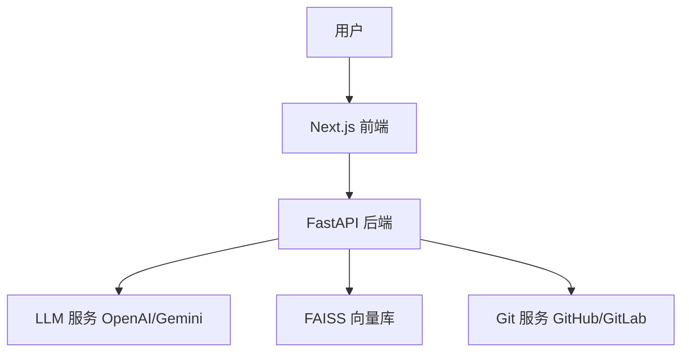

<div align="center">
  <a href="https://github.com/OrionStarAI/DeepV-Ki">
    
  </a>

  <h1 align="center">DeepV-Ki</h1>

  <p align="center">
    <strong>AI-Powered Wiki Generator for Code Repositories</strong>
  </p>
  <p align="center">
    一键将代码仓库转换为美观、交互式的 Wiki 文档 | 智能架构分析 | RAG 代码问答
  </p>

  <p align="center">
    <a href="https://github.com/OrionStarAI/DeepV-Ki/blob/main/LICENSE">
      
    </a>
    <a href="https://www.python.org/">
      
    </a>
    <a href="https://nextjs.org/">
      
    </a>
    <a href="https://github.com/OrionStarAI/DeepV-Ki/stargazers">
      
    </a>
    <a href="https://github.com/OrionStarAI/DeepV-Ki/issues">
      
    </a>
  </p>

  <p align="center">
    <strong>中文</strong> | <a href="README.en.md">English</a>
  </p>
</div>

<br/>

## 📖 简介 (Introduction)

**DeepV-Ki** 是一个由 AI 驱动的开源 Wiki 生成器，旨在解决代码文档维护难、阅读难的问题。只需输入仓库 URL，DeepV-Ki 就会自动分析代码结构、生成详细文档、绘制架构图表（Mermaid），并构建一个支持 RAG（检索增强生成）问答的交互式知识库。

无论是 GitHub、GitLab 还是 Bitbucket，DeepV-Ki 都能帮助开发者快速理解复杂的代码库。

<div align="center">
  
</div>

## 🌟 核心特性 (Features)

| 特性 | 说明 |
| :--- | :--- |
| 📚 **一键 Wiki 生成** | 将任何代码仓库转换为专业的交互式 Wiki，支持多语言（中/英/日等 10+ 种语言）。 |
| 🧠 **智能代码分析** | 使用 AI 深度理解代码结构、设计模式和核心逻辑，自动生成目录和导航。 |
| 📊 **自动架构图表** | 自动生成 Mermaid 流程图、时序图、类图，并支持交互式缩放和平移。 |
| 💬 **RAG 代码问答** | 内置 **Ask** 功能，基于实际代码进行准确问答，支持多轮对话和流式响应。 |
| 🕵️ **DeepResearch** | 深度研究模式，自动生成研究计划并进行多轮迭代调查，输出综合结论。 |
| 🔌 **多模型支持** | 支持 OpenAI, Google Gemini, Azure, AWS Bedrock, Ollama (本地) 等多种 LLM。 |
| 🛡️ **广泛仓库支持** | 支持 GitHub, GitLab (SaaS/Self-hosted), Bitbucket, Gerrit 以及私有仓库。 |

## 🚀 快速开始 (Quick Start)

### 前置要求

*   **Python 3.12+** (后端)
*   **Node.js 18+** (前端)
*   **pnpm** (前端包管理)
*   **uv** (Python 包管理，推荐)

### 1. 克隆仓库

```bash
git clone https://github.com/OrionStarAI/DeepV-Ki.git
cd DeepV-Ki
```

### 2. 配置环境

复制示例配置文件并填入必要的 API Key（如 OpenAI 或 GitLab 配置）：

```bash
cp .env.example .env
# 编辑 .env 文件
# 必填: OPENAI_API_KEY (或其他 LLM Key)
# 选填: GITLAB_CLIENT_ID (如果需要 OAuth)
```

### 3. 一键启动

我们提供了统一的开发环境启动脚本：

```bash
./start_dev.sh
```

启动成功后访问：
*   **前端**: [http://localhost:3000](http://localhost:3000)
*   **后端 API**: [http://localhost:8001/docs](http://localhost:8001/docs)

## 🛠️ 配置说明 (Configuration)

DeepV-Ki 支持灵活的环境变量配置，主要配置项如下：

| 变量名 | 说明 | 示例 |
| :--- | :--- | :--- |
| `OPENAI_API_KEY` | OpenAI API 密钥 | `sk-...` |
| `GOOGLE_API_KEY` | Google Gemini API 密钥 | `AIza...` |
| `DASHSCOPE_API_KEY` | Aliyun DashScope API 密钥 | `sk-...` |
| `GITLAB_URL` | GitLab 实例地址 | `https://gitlab.com` |
| `GITLAB_CLIENT_ID` | GitLab OAuth App ID | `...` |
| `GITLAB_REDIRECT_URI` | OAuth 回调地址 (必须与 GitLab App 配置一致) | `http://localhost:8001/api/auth/gitlab/callback` |
| `GITLAB_SCOPES` | 必须勾选的权限 (Scopes) | `api`, `read_user` |
| `PORT` | 后端服务端口 | `8001` |

> 🔗 **详细指南**：遇到配置问题？请查看 [GitLab OAuth 配置指南](docs/GITLAB_OAUTH_SETUP.md)。

更多配置请参考 `.env.example` 文件。

## 🏗️ 系统架构 (Architecture)

项目采用现代化的前后端分离架构：

*   **Backend (`api/`)**: 基于 **FastAPI** 和 **Python**。负责 Wiki 生成核心逻辑、RAG 系统 (AdalFlow + FAISS)、任务队列和 Git 操作。
*   **Frontend (`frontend/`)**: 基于 **Next.js 15** 和 **React 19**。提供现代化的 UI、Mermaid 图表渲染和流式交互体验。



## 📚 技术栈 (Tech Stack)

<div align="center">
  
</div>

*   **Backend**: Python 3.12, FastAPI, Uvicorn, AdalFlow, FAISS
*   **Frontend**: TypeScript, Next.js 15, React 19, Tailwind CSS 4, Mermaid.js
*   **DevOps**: Docker, uv, pnpm

## 🤝 贡献 (Contributing)

我们非常欢迎社区贡献！如果您有好的想法或发现了 Bug，请：

1.  Fork 本仓库
2.  创建您的特性分支 (`git checkout -b feature/AmazingFeature`)
3.  提交您的更改 (`git commit -m 'Add some AmazingFeature'`)
4.  推送到分支 (`git push origin feature/AmazingFeature`)
5.  开启一个 Pull Request

## 📄 许可证 (License)

本项目采用 [MIT 许可证](LICENSE)。

---

<div align="center">
  <p>Made with ❤️ by the DeepV-Ki Team</p>
</div>